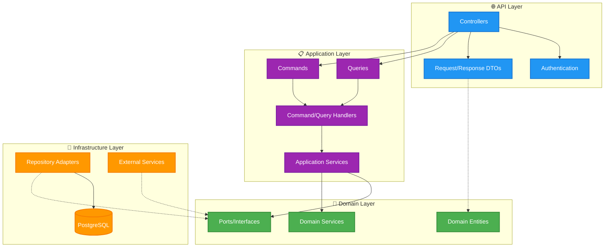

<p align="center"></p>

# 🏗️ Enterprise .NET API with Hexagonal Architecture

<p align="center">
  <strong>Production-ready API implementing Clean Architecture, DDD, and CQRS patterns</strong><br/>
  Built with modern .NET technologies and enterprise best practices
</p>

<p align="center">
  
  
  
  
  
</p>

## 🎯 Key Features

-   **🏢 Clean Architecture**: Hexagonal pattern with clear separation of concerns
-   **📋 CQRS + MediatR**: Command/Query separation for scalable applications
-   **🎯 Domain-Driven Design**: Rich domain models with business rules
-   **🧪 Comprehensive Testing**: 365+ unit and integration tests
-   **🔐 JWT Authentication**: Secure API with role-based authorization
-   **📊 PostgreSQL + EF Core**: Modern database with latest Entity Framework
-   **🐋 Docker Ready**: One-command setup with containerized database
-   **📝 API Documentation**: Interactive Swagger/OpenAPI documentation

## 🚀 Quick Start

```bash
# 1. Clone the repository
git clone https://github.com/asanabrialopez/.net-api-hexagonal-skeleton.git
cd net-api-hexagonal-skeleton

# 2. Start PostgreSQL database
docker-compose up -d

# 3. Run the API
dotnet run --project HexagonalSkeleton.API
```

**🎉 API ready at:** http://localhost:5000/swagger

## 🏗️ Architecture

### Hexagonal Architecture Overview



### Core Patterns Implemented

-   **Hexagonal Architecture**: Ports & Adapters for dependency inversion
-   **CQRS**: Separate read/write models with MediatR
-   **Repository Pattern**: Clean data access abstraction
-   **Specification Pattern**: Reusable business rules
-   **Domain Events**: Decoupled business logic
-   **Exception Handling**: Global error management with custom exceptions

## �️ Technology Stack

| Category           | Technology             | Version |
| ------------------ | ---------------------- | ------- |
| **Framework**      | .NET                   | 9.0     |
| **ORM**            | Entity Framework Core  | 9.0.6   |
| **Database**       | PostgreSQL             | 17      |
| **Authentication** | JWT Bearer             | Latest  |
| **Validation**     | FluentValidation       | 12.0.0  |
| **Mediator**       | MediatR                | 12.5.0  |
| **Mapping**        | AutoMapper             | 14.0.0  |
| **Logging**        | Serilog                | 4.3.0   |
| **Testing**        | xUnit + Testcontainers | Latest  |

## 📁 Project Structure

```
├── HexagonalSkeleton.API/          # 🌐 API Layer
│   ├── Controllers/                # REST API endpoints
│   ├── Models/                     # API request/response models
│   └── Config/                     # DI container configuration
├── HexagonalSkeleton.Application/  # 📋 Application Layer
│   ├── Features/                   # CQRS commands & queries
│   ├── Services/                   # Application services
│   └── Events/                     # Domain event handlers
├── HexagonalSkeleton.Domain/       # 🎯 Domain Layer
│   ├── Entities/                   # Domain entities
│   ├── Services/                   # Domain services
│   ├── Specifications/             # Business rules
│   └── Ports/                      # Interface contracts
├── HexagonalSkeleton.Infrastructure/ # � Infrastructure Layer
│   ├── Persistence/                # Database context & repositories
│   ├── Auth/                       # JWT implementation
│   └── Services/                   # External service adapters
└── HexagonalSkeleton.Test/         # 🧪 Testing
    ├── Unit/                       # Unit tests
    └── Integration/                # Integration tests
```

## 🧪 Testing

**365+ Tests** covering all layers:

```bash
# Run all tests
dotnet test

# Run with coverage
dotnet test --collect:"XPlat Code Coverage"
```

-   **Unit Tests**: Domain logic and business rules
-   **Integration Tests**: End-to-end API workflows with test database
-   **Test Containers**: Isolated database for integration testing

## 🔐 Security Features

-   **JWT Authentication** with role-based authorization
-   **Password Hashing** with secure salt generation
-   **Input Validation** with FluentValidation
-   **Exception Handling** without sensitive data exposure
-   **CORS** configuration for cross-origin requests

## � Development Experience

### Visual Studio / VS Code

-   **F5 Debugging**: Full debugging with automatic Docker setup
-   **Hot Reload**: Real-time code changes with `dotnet watch`
-   **IntelliSense**: Full code completion and error detection

### Database Management

```bash
# Create new migration
dotnet ef migrations add MigrationName --project HexagonalSkeleton.MigrationDb

# Update database
dotnet ef database update --project HexagonalSkeleton.MigrationDb
```

## 📊 API Endpoints

| Endpoint             | Method | Description         |
| -------------------- | ------ | ------------------- |
| `/api/user/register` | POST   | User registration   |
| `/api/user/login`    | POST   | User authentication |
| `/api/user`          | GET    | Get paginated users |
| `/api/user/{id}`     | GET    | Get user by ID      |
| `/api/user/{id}`     | PUT    | Update user profile |

**📖 Full API documentation available at `/swagger`**

## 🎯 Why This Architecture?

This template demonstrates **enterprise-grade** software development practices:

-   **Scalability**: Clean separation allows teams to work in parallel
-   **Maintainability**: SOLID principles ensure long-term code health
-   **Testability**: Dependency injection enables comprehensive testing
-   **Flexibility**: Hexagonal architecture makes changing dependencies easy
-   **Performance**: CQRS optimizes read/write operations separately

Perfect for demonstrating knowledge of **modern .NET development**, **architectural patterns**, and **best practices** in a professional environment.

---

<p align="center">
  <strong>Built with ❤️ for enterprise software development</strong>
</p>

-   **Docker** integration for modern development workflows

### 🎨 Customization Guide

#### **Adding New Features**

1. **Domain First**: Create entities, value objects, business rules
2. **Application Layer**: Add commands/queries with handlers
3. **API Layer**: Create controllers and DTOs
4. **Tests**: Write unit and integration tests
5. **Documentation**: Update Swagger annotations

#### **Configuration Examples**

```bash
# Environment-specific settings
cp appsettings.json appsettings.Production.json
# Modify connection strings, logging levels, etc.

# Database provider swap (SQL Server example)
# Replace in DatabaseServiceExtension.cs:
services.AddDbContextPool<AppDbContext>(options =>
    options.UseSqlServer(connectionString));
```

---

## 🤝 Contributing & Usage

### 📋 Using This Template

1. **Fork/Clone** this repository
2. **Rename** namespaces to match your project
3. **Customize** domain entities for your business
4. **Extend** with additional features
5. **Deploy** with confidence

### 📞 Questions & Support

-   **Architecture Questions**: Study the code - it's self-documenting
-   **Implementation Help**: Check tests for usage examples
-   **Best Practices**: Follow existing patterns and conventions

---

## 📚 Additional Resources

### 📖 Recommended Reading

-   [Clean Architecture (Robert C. Martin)](https://blog.cleancoder.com/uncle-bob/2012/08/13/the-clean-architecture.html)
-   [Domain-Driven Design (Eric Evans)](https://www.domainlanguage.com/ddd/)
-   [.NET Application Architecture Guides](https://docs.microsoft.com/en-us/dotnet/architecture/)

### 🎯 Next Steps

-   Implement authentication features
-   Add more complex business rules
-   Integrate with external services
-   Deploy to cloud platforms
-   Add monitoring and logging

---

<div align="center">

### 💫 Built with passion for clean, maintainable code

**[⭐ Star this repo](https://github.com/asanabrialopez/.net-api-hexagonal-skeleton)** if it helps your projects!

---

_This template represents enterprise-grade .NET development practices.<br/>
Perfect for teams seeking scalable, maintainable API solutions._

</div>
