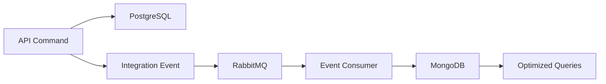
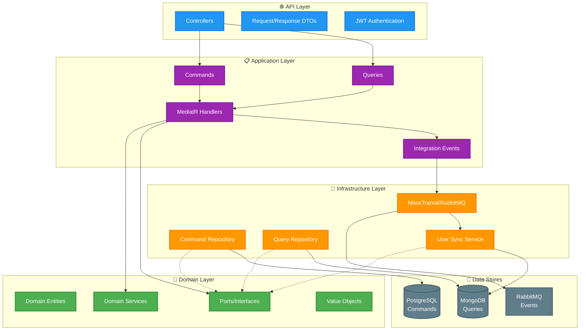
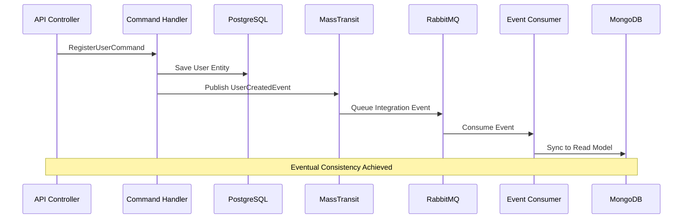

<p align="center"></p>

<p align="center">
  <strong>Production-ready API template implementing Clean Architecture, DDD, CQRS and Event-Driven patterns</strong><br/>
  Built with modern .NET 9 technologies and enterprise best practices
</p>

<p align="center">
  
  
  
  
  
  
</p>

## 🎯 Key Features

-   **🏗️ Hexagonal Architecture**: Clean separation with Ports & Adapters pattern
-   **⚡ CQRS Implementation**: Separate Command (PostgreSQL) and Query (MongoDB) stores
-   **🚀 Event-Driven Architecture**: MassTransit + RabbitMQ for async messaging
-   **🎯 Domain-Driven Design**: Rich domain models with business rules enforcement
-   **🧪 Testing**: 60+ test files with unit and integration coverage
-   **🔐 JWT Authentication**: Secure API with password hashing and validation
-   **📊 Dual Database Strategy**: PostgreSQL for writes, MongoDB for optimized reads
-   **🐋 Full Docker Stack**: PostgreSQL, MongoDB, RabbitMQ containerized
-   **📝 API Documentation**: Interactive Swagger/OpenAPI with detailed schemas
-   **🔄 Eventual Consistency**: RabbitMQ + MassTransit for automatic data synchronization
-   **✨ Clean Code Principles**: DRY, KISS, YAGNI compliant with centralized utilities

## 🛠️ Technology Stack

| Category           | Technology             |
| ------------------ | ---------------------- |
| **Framework**      | .NET 9                 |
| **Command DB**     | PostgreSQL             |
| **Query DB**       | MongoDB                |
| **Message Bus**    | RabbitMQ               |
| **ORM**            | Entity Framework Core  |
| **ODM**            | MongoDB Driver         |
| **Mediator**       | MediatR                |
| **Validation**     | FluentValidation       |
| **Mapping**        | AutoMapper             |
| **Messaging**      | MassTransit            |
| **Authentication** | JWT Bearer             |
| **Logging**        | Serilog                |
| **Testing**        | xUnit + Testcontainers |

### 🔥 Advanced Event-Driven Features

#### **📡 RabbitMQ + MassTransit Integration**

-   **Automatic Event Publishing**: Commands automatically publish integration events
-   **Reliable Message Delivery**: Retry policies with exponential backoff
-   **Consumer Management**: Dedicated consumers for data synchronization
-   **Health Monitoring**: Built-in health checks for message infrastructure

#### **🗄️ Dual Database Architecture**

-   **PostgreSQL (Commands)**: ACID transactions for data consistency
-   **MongoDB (Queries)**: Optimized schemas for complex filtering and search
-   **Automatic Sync**: Event consumers maintain eventual consistency
-   **Performance**: Read/write operations use optimal data stores

#### **⚡ Real-Time Event Flow**



**Key Integration Events:**

-   `UserCreatedIntegrationEvent` → Syncs new user to read model
-   `UserLoggedInIntegrationEvent` → Updates last login timestamp
-   `UserUpdatedIntegrationEvent` → Maintains profile consistency

## 🚀 Development Experience

### VS Code / Visual Studio Ready

-   **F5 Debugging**: Full debugging with automatic Docker infrastructure setup
-   **Hot Reload**: Real-time code changes with `dotnet watch`
-   **IntelliSense**: Complete code completion and error detection
-   **Task Configuration**: Pre-configured build and database startup tasks

### Database Management

```bash
# Create new migration for PostgreSQL (Command store)
dotnet ef migrations add MigrationName --project HexagonalSkeleton.MigrationDb

# Update PostgreSQL database
dotnet ef database update --project HexagonalSkeleton.MigrationDb

# MongoDB collections are automatically created by the application
```

### Event Monitoring

```bash
# Access RabbitMQ Management UI
http://localhost:15672
# user: hexagonal_user, password: hexagonal_password

# Monitor integration events and message flows
# Check consumer status and message throughput
```

<p align="center">
  <strong>Production-ready API template implementing Clean Architecture, DDD, CQRS and Event-Driven patterns</strong><br/>
  Built with modern .NET 9 technologies and enterprise best practices
</p>

<p align="center">
  
  
  
  
  
  
</p>

## 🎯 Key Features

-   **�️ Hexagonal Architecture**: Clean separation with Ports & Adapters pattern
-   **⚡ CQRS Implementation**: Separate Command (PostgreSQL) and Query (MongoDB) stores
-   **🚀 Event-Driven Architecture**: MassTransit + RabbitMQ for async messaging
-   **🎯 Domain-Driven Design**: Rich domain models with business rules enforcement
-   **🧪 Comprehensive Testing**: 44+ test files with unit and integration coverage
-   **🔐 JWT Authentication**: Secure API with password hashing and validation
-   **📊 Dual Database Strategy**: PostgreSQL for writes, MongoDB for optimized reads
-   **🐋 Full Docker Stack**: PostgreSQL, MongoDB, RabbitMQ containerized
-   **📝 API Documentation**: Interactive Swagger/OpenAPI with detailed schemas
-   **🔄 Eventual Consistency**: RabbitMQ + MassTransit for automatic data synchronization
-   **📡 Event-Driven Architecture**: Integration events for decoupled communication
-   **🎯 Dual Database Strategy**: PostgreSQL + MongoDB optimized for different patterns

## 🚀 Quick Start

```bash
# 1. Clone the repository
git clone https://github.com/asanabrialopez/.net-api-hexagonal-skeleton.git
cd .net-api-hexagonal-skeleton

# 2. Start the complete infrastructure stack
docker-compose up -d --wait

# 3. Run database migrations
dotnet ef database update --project HexagonalSkeleton.MigrationDb

# 4. Start the API
dotnet run --project HexagonalSkeleton.API
```

**🎉 Ready to go!**

-   **API**: http://localhost:5000/swagger
-   **RabbitMQ Management**: http://localhost:15672 (user: hexagonal_user, password: hexagonal_password)
-   **PostgreSQL**: localhost:5432 (Commands/Writes)
-   **MongoDB**: localhost:27017 (Queries/Reads)

## 🏗️ Architecture

### Hexagonal Architecture with CQRS & Event Sourcing



### Core Patterns Implemented

-   **🏗️ Hexagonal Architecture**: Ports & Adapters with clean dependency inversion
-   **⚡ CQRS Pattern**: Separate optimized stores for commands and queries
-   **🚀 Event-Driven Architecture**: Async messaging with MassTransit and RabbitMQ
-   **🔄 Eventual Consistency**: Automated synchronization between data stores
-   **📦 Repository Pattern**: Clean data access abstraction layer
-   **📋 Specification Pattern**: Reusable and composable business rules
-   **🎯 Domain Events**: Decoupled business logic with integration events
-   **🛡️ Exception Handling**: Global error management with custom exceptions

## 📁 Project Structure

```
├── HexagonalSkeleton.API/          # 🌐 API Layer
│   ├── Controllers/                # REST API endpoints
│   ├── Models/                     # API request/response models
│   └── Config/                     # DI container configuration
├── HexagonalSkeleton.Application/  # 📋 Application Layer
│   ├── Features/                   # CQRS commands & queries
│   ├── Services/                   # Application services
│   └── Events/                     # Domain event handlers
├── HexagonalSkeleton.Domain/       # 🎯 Domain Layer
│   ├── Entities/                   # Domain entities (User.cs)
│   ├── Services/                   # Domain services
│   ├── Specifications/             # Business rules
│   ├── Common/                     # Shared utilities (AgeCalculator)
│   └── Ports/                      # Interface contracts
├── HexagonalSkeleton.Infrastructure/ # 🔧 Infrastructure Layer
│   ├── Persistence/                # Database context & repositories
│   ├── Auth/                       # JWT implementation
│   └── Services/                   # External service adapters
└── HexagonalSkeleton.Test/         # 🧪 Testing
    ├── Unit/                       # Unit tests (60+ test files)
    ├── Integration/                # Integration tests
    └── TestInfrastructure/         # Testing utilities
```

## 🧪 Testing

**60+ Test Files** covering all architectural layers:

```bash
# Run all tests
dotnet test

# Run with coverage
dotnet test --collect:"XPlat Code Coverage"

# Run specific test category
dotnet test --filter "Category=Integration"
```

### Test Categories

-   **Unit Tests**: Domain logic, business rules, and value objects (including AgeCalculator)
-   **Integration Tests**: End-to-end API workflows with test infrastructure
-   **CQRS Tests**: Command and query handler validation
-   **Event Tests**: Integration event publishing and consumption
-   **Repository Tests**: Data access layer with in-memory databases
-   **Authentication Tests**: JWT token generation and validation

-   **Unit Tests**: Domain logic, business rules, and value objects
-   **Integration Tests**: End-to-end API workflows with test infrastructure
-   **CQRS Tests**: Command and query handler validation
-   **Event Tests**: Integration event publishing and consumption
-   **Repository Tests**: Data access layer with in-memory databases
-   **Authentication Tests**: JWT token generation and validation

### Test Infrastructure

-   **TestWebApplicationFactory**: Custom factory replacing production dependencies
-   **In-Memory Databases**: SQLite for commands, in-memory MongoDB for queries
-   **AutoFixture**: Automated test data generation for comprehensive scenarios
-   **Test Containers**: Docker-based integration testing when needed
-   **Centralized Test Utilities**: DRY-compliant test data creation with `TestHelper.cs`
-   **Domain Utility Testing**: Comprehensive coverage of `AgeCalculator` with edge cases
-   **Postman Collection**: 66 automated API tests covering all endpoints and business rules

## 🔐 Security Features

-   **JWT Authentication** with configurable expiration and secure token generation
-   **Password Hashing** with salt generation using industry-standard algorithms
-   **Input Validation** with FluentValidation for comprehensive request validation
-   **Global Exception Handling** without sensitive data exposure in responses
-   **CORS** configuration for secure cross-origin requests
-   **Authorization Attributes** for role-based endpoint protection

## ✨ Clean Code Principles Implementation

### 🎯 DRY (Don't Repeat Yourself)

-   **Centralized Age Calculation**: `AgeCalculator` utility eliminates duplicate age logic across domain, validation, and mapping layers
-   **Unified Test Utilities**: `TestHelper.cs` provides consistent test data creation methods
-   **Shared Domain Logic**: Business rules centralized in domain services and specifications

### 💎 KISS (Keep It Simple, Stupid)

-   **Clear Method Names**: `CalculateAge()`, `IsAtLeastAge()`, `IsWithinAgeRange()` with obvious intent
-   **Single Responsibility**: Each utility class focuses on one specific domain concern
-   **Readable Business Logic**: Age validation expressed in natural, domain-friendly terms

### 🚀 YAGNI (You Aren't Gonna Need It)

-   **Focused Implementation**: Only essential age calculation methods without over-engineering
-   **Minimal Dependencies**: Clean utilities with zero external dependencies
-   **Pragmatic Design**: Business rules implemented as needed, not speculatively

## � Development Experience

### Visual Studio / VS Code

-   **F5 Debugging**: Full debugging with automatic Docker setup
-   **Hot Reload**: Real-time code changes with `dotnet watch`
-   **IntelliSense**: Full code completion and error detection

### Database Management

```bash
# Create new migration
dotnet ef migrations add MigrationName --project HexagonalSkeleton.MigrationDb

# Update database
dotnet ef database update --project HexagonalSkeleton.MigrationDb
```

## 📊 API Endpoints

### 🔐 Authentication & Registration

| Endpoint            | Method | Description                        | Response                   | Business Rules                   |
| ------------------- | ------ | ---------------------------------- | -------------------------- | -------------------------------- |
| `/api/auth/login`   | POST   | User authentication with JWT       | AuthenticationToken + User | Password validation, user exists |
| `/api/registration` | POST   | User registration + authentication | AuthenticationToken + User | Age 13-120 years, email unique   |

### 👤 User Management (Admin)

| Endpoint                     | Method | Description                    | Database Used |
| ---------------------------- | ------ | ------------------------------ | ------------- |
| `/api/users`                 | GET    | Paginated users with filtering | MongoDB       |
| `/api/users/{id}`            | GET    | Get user by ID                 | MongoDB       |
| `/api/users`                 | PUT    | Update user (admin)            | PostgreSQL    |
| `/api/users/{id}`            | DELETE | Hard delete user               | PostgreSQL    |
| `/api/users/{id}/deactivate` | POST   | Soft delete (deactivate)       | PostgreSQL    |

### 🏠 User Profile (Self-Service)

| Endpoint                     | Method | Description                 | Database Used |
| ---------------------------- | ------ | --------------------------- | ------------- |
| `/api/profile`               | GET    | Get own profile             | MongoDB       |
| `/api/profile/personal-info` | PATCH  | Update personal information | PostgreSQL    |

### 🔄 Event-Driven Synchronization

**How it works:**

1. **Write Operations** → PostgreSQL (Commands)
2. **Integration Events** → RabbitMQ via MassTransit
3. **Event Consumers** → Sync to MongoDB (Queries)
4. **Read Operations** → MongoDB (Optimized for queries)

**📖 Full API documentation with request/response schemas at `/swagger`**.

## 🎯 Why This Architecture?

This template demonstrates **production-ready** enterprise software development:

### 🔥 Technical Excellence

-   **Scalability**: CQRS enables independent scaling of read/write operations
-   **Performance**: Dual databases optimized for specific access patterns
-   **Reliability**: Event-driven architecture with guaranteed message delivery via RabbitMQ
-   **Maintainability**: Clean Architecture with clear separation of concerns
-   **Testability**: Comprehensive test coverage with dependency injection
-   **Resilience**: Retry policies and error handling for distributed systems
-   **Code Quality**: DRY, KISS, YAGNI principles with centralized utilities
-   **Business Logic**: Domain-driven design with rich business rules enforcement

### 💼 Enterprise Benefits

-   **Team Productivity**: Multiple teams can work on different bounded contexts
-   **Technology Flexibility**: Easy to swap databases or messaging systems
-   **Monitoring & Observability**: Built-in logging, health checks, and event tracking
-   **Deployment Ready**: Docker containerization for any cloud platform
-   **Data Consistency**: ACID transactions for commands, eventual consistency for queries

### 🚀 Interview-Ready Features

Perfect for demonstrating expertise in:

-   **Modern .NET Development** (9.0 with latest packages)
-   **Distributed Systems** (CQRS + Event Sourcing patterns)
-   **Event-Driven Architecture** (RabbitMQ + MassTransit)
-   **Database Design** (PostgreSQL + MongoDB optimization)
-   **Enterprise Patterns** (Hexagonal Architecture, DDD, SOLID principles)
-   **Clean Code Principles** (DRY, KISS, YAGNI with practical examples)
-   **Domain-Driven Design** (Business rules, age calculations, specifications)
-   **Comprehensive Testing** (Unit, integration, API testing with 60+ test files)

---

## 🔄 CQRS & Event Flow

### How it Works



### Event-Driven Sync Process

1. **Command Execution**: Write operations go to PostgreSQL with full ACID compliance
2. **Event Publishing**: MassTransit automatically publishes integration events to RabbitMQ
3. **Reliable Delivery**: RabbitMQ ensures message delivery with retry policies
4. **Event Consumption**: Dedicated consumers sync data to MongoDB read models
5. **Query Optimization**: Read operations use optimized MongoDB collections with indexes

---

## 🎨 Customization Guide

### **Adding New Features**

1. **Domain First**: Create entities, value objects, business rules
2. **Command/Query**: Add MediatR handlers for CQRS operations
3. **Events**: Define integration events for cross-bounded context communication
4. **API Layer**: Create controllers and DTOs
5. **Sync Logic**: Update consumers for read model consistency
6. **Tests**: Write comprehensive unit and integration tests

### **Configuration Examples**

```bash
# Environment-specific settings
cp appsettings.json appsettings.Production.json
# Modify connection strings, logging levels, etc.

# Swap PostgreSQL for SQL Server (Command store)
# In CqrsDatabaseExtension.cs:
services.AddDbContextPool<CommandDbContext>(options =>
    options.UseSqlServer(connectionString));

# Configure RabbitMQ clustering
# In docker-compose.yml or appsettings.json
```

---

## 🚀 Deployment Ready

### Docker Compose Production

```yaml
# docker-compose.prod.yml
services:
    api:
        build: .
        environment:
            - ASPNETCORE_ENVIRONMENT=Production
            - ConnectionStrings__HexagonalSkeleton=${PG_CONNECTION}
            - ConnectionStrings__HexagonalSkeletonRead=${MONGO_CONNECTION}
    # ... database services with volumes and health checks
```

## 🤝 Contributing & Usage

### 📋 Using This Template

1. **Fork/Clone** this repository
2. **Rename** namespaces to match your project (e.g., `YourCompany.YourDomain`)
3. **Customize** domain entities and business rules for your use case
4. **Extend** with additional bounded contexts and features
5. **Deploy** with confidence using the provided Docker configuration

### � Advanced Scenarios

-   **Multi-tenant**: Add tenant isolation to both command and query stores
-   **Saga Patterns**: Implement distributed transactions with MassTransit
-   **API Versioning**: Add versioned endpoints with backward compatibility
-   **GraphQL**: Replace REST controllers with GraphQL endpoints
-   **Real-time**: Add SignalR for real-time notifications

---

## 📚 Learning Resources

### 📖 Recommended Reading

-   [Clean Architecture (Robert C. Martin)](https://blog.cleancoder.com/uncle-bob/2012/08/13/the-clean-architecture.html)
-   [Implementing Domain-Driven Design (Vaughn Vernon)](https://www.oreilly.com/library/view/implementing-domain-driven-design/9780133039900/)
-   [Building Event-Driven Microservices (Adam Bellemare)](https://www.oreilly.com/library/view/building-event-driven-microservices/9781492057888/)
-   [.NET Microservices Architecture Guide](https://docs.microsoft.com/en-us/dotnet/architecture/microservices/)

### 🎯 What You'll Learn

-   **Hexagonal Architecture** implementation with ports & adapters in .NET
-   **CQRS Pattern** with separate optimized data stores (PostgreSQL + MongoDB)
-   **Event-Driven Architecture** with reliable messaging using RabbitMQ + MassTransit
-   **Domain-Driven Design** with rich domain models and business logic encapsulation
-   **Enterprise Testing** strategies including unit, integration, and end-to-end tests
-   **Modern .NET** development practices with dependency injection and clean code
-   **Microservices Patterns** ready for distributed system development
-   **Database Optimization** for both transactional and analytical workloads
-   **Clean Code Principles** practical implementation of DRY, KISS, YAGNI
-   **Business Rules Engineering** centralized utilities for domain calculations

---

<div align="center">

### 💫 Built with passion for enterprise-grade software architecture

**[⭐ Star this repo](https://github.com/asanabrialopez/.net-api-hexagonal-skeleton)** if it demonstrates valuable patterns for your projects!

_This template showcases enterprise-grade .NET development with modern architectural patterns.<br/>
Perfect for technical interviews and production-ready applications._

</div>
