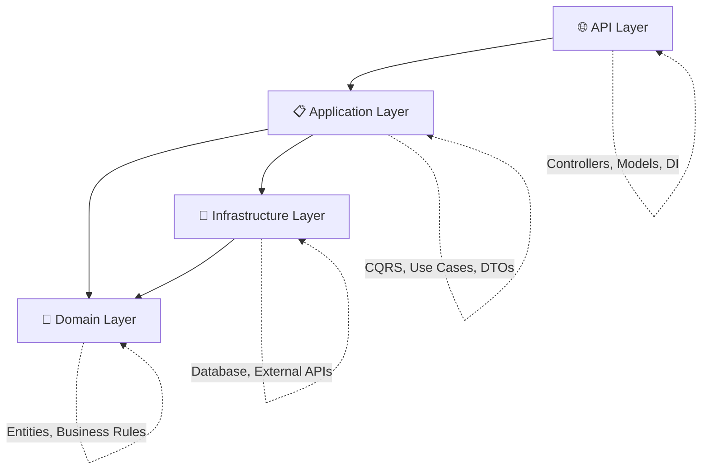

<p align="center"></p>

# 🏗️ Enterprise .NET 9 API Template

## Clean Architecture | Hexagonal Design | DDD & CQRS

<p align="center">
  <strong>Production-ready template implementing enterprise-grade patterns and best practices</strong><br/>
  Perfect for scaling teams and complex business domains
</p>

<p align="center">
  
  
  
  
  
</p>

---

## 🎯 Why This Template?

This isn't just another API template. It's a **battle-tested foundation** that solves real enterprise challenges:

-   **🏢 Enterprise Ready**: Patterns used by Fortune 500 companies
-   **📏 Scalable Architecture**: Clean separation of concerns for large teams
-   **🧪 Test-Driven**: Comprehensive testing strategy (Unit + Integration)
-   **🚀 Developer Experience**: F5 debugging with Docker dependencies
-   **📋 Production Patterns**: Error handling, logging, validation, security

### 💼 Business Value

-   **Faster Time-to-Market**: Jump-start projects with proven patterns
-   **Reduced Technical Debt**: Clean architecture prevents common pitfalls
-   **Team Productivity**: Clear boundaries enable parallel development
-   **Maintainability**: SOLID principles ensure long-term code health

---

## 🚀 Quick Start

### Prerequisites

-   [.NET 9 SDK](https://dotnet.microsoft.com/download/dotnet/9.0) 🔧
-   [Docker](https://www.docker.com/get-started) 🐋

### Get Running in 3 Steps

```bash
# 1. Clone and navigate
git clone https://github.com/asanabrialopez/.net-api-hexagonal-skeleton.git
cd net-api-hexagonal-skeleton

# 2. Start dependencies
docker-compose up -d

# 3. Run API (with automatic migrations)
dotnet run --project HexagonalSkeleton.API
```

**🎉 That's it!** API available at: http://localhost:5000/swagger

### 🛠️ Development Setup

**Visual Studio / VS Code:**

-   Press **F5** to debug
-   Dependencies start automatically
-   Swagger opens in browser
-   Full debugging capabilities

**Docker-First Development:**

```bash
# Database in container, API local = Best of both worlds
docker-compose up -d              # Start MariaDB
dotnet watch --project HexagonalSkeleton.API  # Hot reload API
```

---

## 🏗️ Architecture Overview

### Clean Architecture Layers



### 📁 Project Structure

```
🏗️ HexagonalSkeleton.API          # 🌐 Presentation Layer
├── Controllers/                   # REST endpoints
├── Models/                        # Request/Response DTOs
├── Config/                        # Dependency injection
└── Extensions/                    # API-specific utilities

📋 HexagonalSkeleton.Application   # 📋 Use Cases Layer
├── Commands/                      # Write operations (CQRS)
├── Queries/                       # Read operations (CQRS)
├── Services/                      # Application services
└── Dto/                          # Internal data contracts

🎯 HexagonalSkeleton.Domain        # 🎯 Business Logic Layer
├── User.cs                        # Aggregate roots
├── ValueObjects/                  # Domain primitives
├── Services/                      # Domain services
├── Specifications/                # Business rules
└── Events/                        # Domain events

🔧 HexagonalSkeleton.Infrastructure # 🔧 External Concerns
├── Persistence/                   # Data access
├── Adapters/                      # External integrations
└── Auth/                          # Security implementations

🧪 HexagonalSkeleton.Test          # 🧪 Testing Strategy
├── Unit/                          # Isolated tests
├── Integration/                   # End-to-end tests
└── TestWebApplicationFactory.cs   # Test infrastructure
```

---

## 🔧 Technical Excellence

### 🏛️ Architecture Patterns

| Pattern                    | Implementation                   | Business Value                                |
| -------------------------- | -------------------------------- | --------------------------------------------- |
| **Hexagonal Architecture** | Clean separation of concerns     | Testable, maintainable, technology-agnostic   |
| **CQRS**                   | Separate read/write models       | Optimized performance, clear responsibilities |
| **DDD**                    | Rich domain model, value objects | Business logic protection, expressive code    |
| **SOLID Principles**       | Dependency inversion, SRP        | Easy to extend, modify, and test              |
| **Specification Pattern**  | Composable business rules        | Reusable queries, testable logic              |

### 🛡️ Enterprise Features

#### **Security & Validation**

-   **JWT Authentication** with refresh tokens
-   **FluentValidation** for input validation
-   **Global Exception Handling** with proper HTTP status codes
-   **CORS** configuration for cross-origin requests

#### **Data & Performance**

-   **Entity Framework Core** with optimized queries
-   **Repository Pattern** with specification support
-   **Connection Pooling** for database efficiency
-   **Pagination** with metadata for large datasets

#### **Developer Experience**

-   **Comprehensive Testing** (Unit + Integration)
-   **AutoMapper** for clean object mapping
-   **Swagger/OpenAPI** documentation
-   **Structured Logging** with Serilog
-   **Docker-first** development workflow

#### **Code Quality**

-   **Clean Code** principles throughout
-   **Consistent Naming** conventions
-   **Extension Methods** for readability
-   **Immutable Value Objects** for data integrity

### 📊 API Features

#### **User Management**

```bash
# Complete CRUD operations
POST   /api/users              # Create user
GET    /api/users              # Get paginated users
GET    /api/users/{id}         # Get user by ID
PUT    /api/users/{id}         # Update user
DELETE /api/users/{id}         # Soft delete user

# Advanced filtering
GET /api/users?searchTerm=john&onlyAdults=true&pageSize=20
```

#### **Smart Search & Filtering**

-   **Unified search** across name, email, phone with `searchTerm`
-   **Specification Pattern** for composable, testable business rules
-   **Advanced filtering** (age ranges, location-based, business rules)
-   **Sorting** by any field with direction control
-   **Pagination** with total count metadata

```bash
# Examples of advanced filtering
GET /api/users?searchTerm=john                    # Text search
GET /api/users?onlyAdults=true&minAge=25          # Business rules
GET /api/users?latitude=40.7&longitude=-74&radiusInKm=10  # Location
GET /api/users?searchTerm=@company.com&onlyCompleteProfiles=true  # Combined
```

#### **Error Handling**

```json
{
    "type": "ValidationError",
    "title": "Invalid user data",
    "status": 400,
    "errors": {
        "Email": ["Email format is invalid"],
        "Age": ["Age must be greater than 0"]
    }
}
```

---

## 🧪 Testing Strategy

### Comprehensive Test Coverage

```bash
# Run all tests
dotnet test

# Run with coverage
dotnet test --collect:"XPlat Code Coverage"

# Watch mode for TDD
dotnet watch test
```

#### **Test Architecture**

-   **Unit Tests**: Fast, isolated, business logic validation
-   **Integration Tests**: End-to-end API testing with real database
-   **Test Fixtures**: Reusable test data and configurations
-   **In-Memory Database**: Isolated test environment

#### **Testing Philosophy**

```csharp
// Example: Clean, readable tests
[Fact]
public async Task Handle_ValidUser_ShouldCreateUser()
{
    // Arrange
    var command = new RegisterUserCommand("john@example.com", "John", "Doe");

    // Act
    var result = await _handler.Handle(command, CancellationToken.None);

    // Assert
    Assert.NotNull(result);
    Assert.Equal("john@example.com", result.Email);
}
```

---

## 🛠️ Technology Stack

### Core Technologies

| Technology                | Version | Purpose               |
| ------------------------- | ------- | --------------------- |
| **.NET**                  | 9.0     | Runtime and framework |
| **ASP.NET Core**          | 9.0     | Web API framework     |
| **Entity Framework Core** | 9.0     | ORM and data access   |
| **MariaDB**               | 11.0    | Primary database      |
| **Docker**                | Latest  | Containerization      |

### Libraries & Packages

| Package              | Purpose             | Why This Choice                   |
| -------------------- | ------------------- | --------------------------------- |
| **MediatR**          | CQRS implementation | Decoupled request handling        |
| **FluentValidation** | Input validation    | Expressive, testable validation   |
| **AutoMapper**       | Object mapping      | Consistent DTO mapping            |
| **Serilog**          | Structured logging  | Rich logging capabilities         |
| **Swashbuckle**      | API documentation   | Interactive API docs              |
| **xUnit**            | Unit testing        | Modern, extensible test framework |

### Development Tools

-   **VS Code Tasks** for streamlined development
-   **Docker Compose** for dependency management
-   **EF Core Migrations** for database versioning
-   **Global Exception Handling** for consistent error responses

---

## 🎯 Business Use Cases

### Real-World Applications

This template solves common enterprise challenges:

#### **📋 User Management System**

-   Employee directories
-   Customer databases
-   Member management
-   Access control systems

#### **🏢 Enterprise APIs**

-   Microservice foundations
-   Domain service APIs
-   Integration platforms
-   Data service layers

#### **🚀 Scalable Solutions**

-   Multi-tenant applications
-   High-traffic APIs
-   Complex business domains
-   Team collaboration platforms

### 💡 Implementation Examples

```csharp
// Example: Adding a new feature (Product Management)

// 1. Domain Entity
public class Product : AggregateRoot<int>
{
    public ProductName Name { get; private set; }
    public Money Price { get; private set; }
    // Business rules encapsulated
}

// 2. CQRS Command
public record CreateProductCommand(string Name, decimal Price)
    : IRequest<ProductDto>;

// 3. Handler with validation
public class CreateProductHandler : IRequestHandler<CreateProductCommand, ProductDto>
{
    // Clean, testable implementation
}

// 4. API Controller
[ApiController]
public class ProductController : ControllerBase
{
    // Thin controller, delegates to MediatR
}
```

---

## 📈 Performance & Scalability

### Optimization Strategies

-   **Connection Pooling**: Efficient database connections
-   **Async/Await**: Non-blocking operations throughout
-   **Specification Pattern**: Optimized, reusable queries
-   **Pagination**: Memory-efficient large dataset handling
-   **Lazy Loading**: On-demand data retrieval

### Monitoring & Observability

-   **Structured Logging**: Searchable, correlatable logs
-   **Exception Tracking**: Centralized error handling
-   **API Documentation**: Always up-to-date Swagger
-   **Health Checks**: Application status monitoring

---

## 🚀 Production Readiness

### Deployment Considerations

#### **Environment Configuration**

```json
{
    "ConnectionStrings": {
        "HexagonalSkeleton": "Server=prod-db;Database=app;..."
    },
    "Logging": {
        "LogLevel": { "Default": "Information" }
    },
    "JWT": {
        "Key": "production-secret-key",
        "Issuer": "your-company.com"
    }
}
```

#### **Docker Production**

```dockerfile
# Multi-stage build for optimization
FROM mcr.microsoft.com/dotnet/sdk:9.0 AS build
COPY . .
RUN dotnet publish -c Release -o /app

FROM mcr.microsoft.com/dotnet/aspnet:9.0
COPY --from=build /app .
ENTRYPOINT ["dotnet", "HexagonalSkeleton.API.dll"]
```

#### **Security Checklist**

-   ✅ JWT token validation
-   ✅ Input validation and sanitization
-   ✅ SQL injection prevention (EF Core)
-   ✅ CORS configuration
-   ✅ HTTPS enforcement
-   ✅ Sensitive data protection

---

## 👨‍💻 For Developers

### 🎯 What You Get

✅ **Immediate Productivity**: Start building features, not infrastructure  
✅ **Best Practices**: Enterprise patterns proven in production  
✅ **Full Testing Suite**: Unit + Integration tests included  
✅ **Developer Experience**: F5 debugging with Docker dependencies  
✅ **Documentation**: Self-documenting code and comprehensive README

### 🧠 Learning Opportunities

This template demonstrates:

-   **Clean Architecture** implementation in .NET
-   **Domain-Driven Design** patterns and practices
-   **CQRS** with MediatR for scalable applications
-   **Specification Pattern** for flexible querying
-   **Test-Driven Development** with comprehensive coverage
-   **Docker** integration for modern development workflows

### 🎨 Customization Guide

#### **Adding New Features**

1. **Domain First**: Create entities, value objects, business rules
2. **Application Layer**: Add commands/queries with handlers
3. **API Layer**: Create controllers and DTOs
4. **Tests**: Write unit and integration tests
5. **Documentation**: Update Swagger annotations

#### **Configuration Examples**

```bash
# Environment-specific settings
cp appsettings.json appsettings.Production.json
# Modify connection strings, logging levels, etc.

# Database provider swap (SQL Server example)
# Replace in DatabaseServiceExtension.cs:
services.AddDbContextPool<AppDbContext>(options =>
    options.UseSqlServer(connectionString));
```

---

## 🤝 Contributing & Usage

### 📋 Using This Template

1. **Fork/Clone** this repository
2. **Rename** namespaces to match your project
3. **Customize** domain entities for your business
4. **Extend** with additional features
5. **Deploy** with confidence

### 📞 Questions & Support

-   **Architecture Questions**: Study the code - it's self-documenting
-   **Implementation Help**: Check tests for usage examples
-   **Best Practices**: Follow existing patterns and conventions

---

## 📚 Additional Resources

### 📖 Recommended Reading

-   [Clean Architecture (Robert C. Martin)](https://blog.cleancoder.com/uncle-bob/2012/08/13/the-clean-architecture.html)
-   [Domain-Driven Design (Eric Evans)](https://www.domainlanguage.com/ddd/)
-   [.NET Application Architecture Guides](https://docs.microsoft.com/en-us/dotnet/architecture/)

### 🎯 Next Steps

-   Implement authentication features
-   Add more complex business rules
-   Integrate with external services
-   Deploy to cloud platforms
-   Add monitoring and logging

---

<div align="center">

### 💫 Built with passion for clean, maintainable code

**[⭐ Star this repo](https://github.com/asanabrialopez/.net-api-hexagonal-skeleton)** if it helps your projects!

---

_This template represents enterprise-grade .NET development practices.<br/>
Perfect for teams seeking scalable, maintainable API solutions._

</div>
