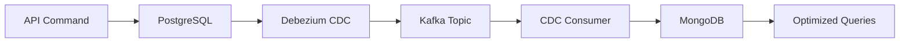
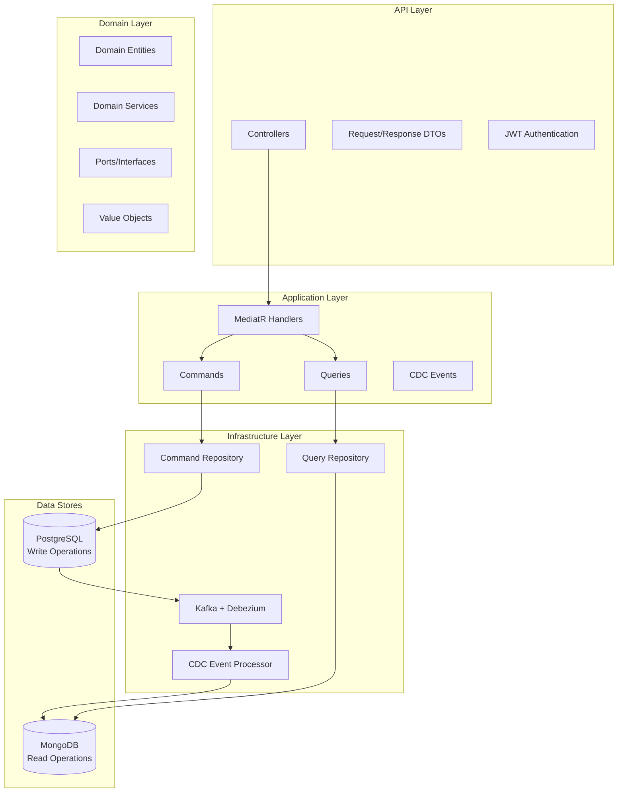
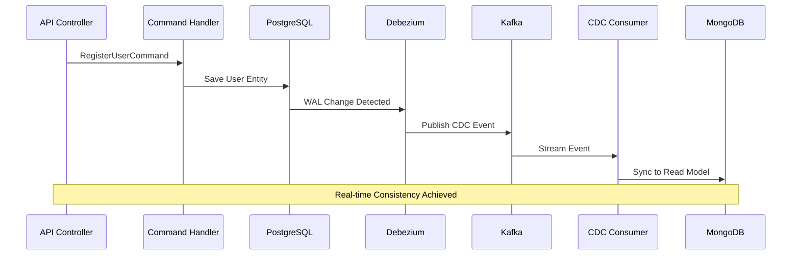

<p align="center">
  
</p>

<p align="center">
  <strong>Production-ready API template implementing Clean Architecture, DDD, CQRS with Change Data Capture</strong><br/>
  Built with modern .NET 9 technologies and enterprise-grade data synchronization
</p>

<p align="center">
  
  
  
  
  
  
  
</p>

## Key Features

-   **Hexagonal Architecture**: Clean separation with Ports & Adapters pattern
-   **CQRS Implementation**: Separate Command (PostgreSQL) and Query (MongoDB) stores
-   **Change Data Capture**: Real-time synchronization using Debezium + Kafka
-   **Domain-Driven Design**: Rich domain models with business rules enforcement
-   **JWT Authentication**: Secure API with password hashing and validation
-   **Dual Database Strategy**: PostgreSQL for writes, MongoDB for optimized reads
-   **Complete Stack**: PostgreSQL, MongoDB, Kafka, Debezium fully containerized
-   **API Documentation**: Interactive Swagger/OpenAPI with detailed schemas
-   **Event Streaming**: Kafka-based CDC for instant data synchronization
-   **Clean Code Principles**: DRY, KISS, YAGNI compliant with centralized utilities
-   **Testing**: 60+ test files with unit and integration coverage

## Technology Stack

| Category           | Technology             |
| ------------------ | ---------------------- |
| **Framework**      | .NET 9                 |
| **Command DB**     | PostgreSQL             |
| **Query DB**       | MongoDB                |
| **Message Stream** | Apache Kafka           |
| **CDC Platform**   | Debezium               |
| **ORM**            | Entity Framework Core  |
| **ODM**            | MongoDB Driver         |
| **Mediator**       | MediatR                |
| **Validation**     | FluentValidation       |
| **Mapping**        | AutoMapper             |
| **Authentication** | JWT Bearer             |
| **Logging**        | Serilog                |
| **Testing**        | xUnit + Testcontainers |

### Change Data Capture with Debezium

**Real-time sync**: PostgreSQL changes stream directly to MongoDB via Kafka  
**Zero downtime**: Schema changes handled automatically  
**Reliable**: Built-in failure recovery with offset tracking

**How it works**: Write to PostgreSQL → Debezium captures WAL changes → Kafka streams → MongoDB gets updated


```mermaid
graph LR
    A[API Command] --> B[PostgreSQL]
    B --> C[Debezium CDC]
    C --> D[Kafka Topic]
    D --> E[CDC Consumer]
    E --> F[MongoDB]
    F --> G[Optimized Queries]
```

**Key CDC Events:**

-   `user.created` → Syncs new user to read model
-   `user.updated` → Maintains profile consistency
-   `user.deleted` → Handles logical deletion synchronization

### Why CDC Over Other Sync Strategies?

**CDC vs Domain Events**: No application code changes needed, captures direct SQL modifications
**CDC vs API Polling**: Real-time latency without rate limiting headaches
**CDC vs ETL/DevOps Jobs**: Sub-second sync instead of scheduled batch processes

Used by Netflix, Uber, LinkedIn, and many others for real-time data synchronization.

### Getting Started

The `setup.ps1` script handles all initialization tasks:

```powershell
# What the script does:
# 1. Runs EF Core migrations against PostgreSQL
# 2. Configures Debezium CDC connector for the users table
# 3. Sets up Kafka topic routing for real-time synchronization
# 4. Validates all services are running correctly

./setup.ps1  # One command to rule them all
```

### Database Management

```bash
# Create new migration for PostgreSQL (Command store)
dotnet ef migrations add MigrationName --project HexagonalSkeleton.MigrationDb

# Update PostgreSQL database
dotnet ef database update --project HexagonalSkeleton.MigrationDb

# MongoDB collections are automatically created by the CDC consumers
```

### CDC Monitoring

```bash
# Monitor Kafka topics and CDC events
# Access Confluent Control Center or use Kafka CLI tools
docker exec -it hexagonal-kafka kafka-topics --list --bootstrap-server localhost:9092

# Check Debezium connector status
curl -H "Accept:application/json" localhost:8083/connectors/postgres-users-connector/status
```

## Quick Start

```bash
# 1. Clone the repository
git clone https://github.com/asanabrialopez/.net-api-hexagonal-skeleton.git
cd .net-api-hexagonal-skeleton

# 2. Start the complete infrastructure stack
docker-compose up -d --wait

# 3. Run the setup script (migrations + CDC configuration)
./setup.ps1

# 4. Start the API
dotnet run --project HexagonalSkeleton.API
```

### Access Points

-   **API Documentation**: http://localhost:5000/swagger
-   **PostgreSQL**: localhost:5432 (Commands/Writes)
-   **MongoDB**: localhost:27017 (Queries/Reads)
-   **Kafka**: localhost:9092 (Event Streaming)
-   **Debezium Connect**: localhost:8083 (CDC Management)

### Test the Flow

```bash
# Register a new user (writes to PostgreSQL)
curl -X POST http://localhost:5000/api/registration \
  -H "Content-Type: application/json" \
  -d '{"email": "test@example.com", "password": "Test123!", "firstName": "John", "lastName": "Doe"}'

# Query users (reads from MongoDB - synced via CDC)
curl http://localhost:5000/api/users
```

## Architecture

### Hexagonal Architecture with CQRS & CDC


```mermaid
graph TB
    subgraph "API Layer"
        Controllers[Controllers]
        DTOs[Request/Response DTOs]
        Auth[JWT Authentication]
    end

    subgraph "Application Layer"
        Commands[Commands]
        Queries[Queries]
        Handlers[MediatR Handlers]
        CdcEvents[CDC Events]
    end

    subgraph "Domain Layer"
        Entities[Domain Entities]
        DomainServices[Domain Services]
        Ports[Ports/Interfaces]
        ValueObjects[Value Objects]
    end

    subgraph "Infrastructure Layer"
        WriteRepo[Command Repository]
        ReadRepo[Query Repository]
        CdcProcessor[CDC Event Processor]
        Kafka[Kafka + Debezium]
    end

    subgraph "Data Stores"
        PostgreSQL[(PostgreSQL<br/>Write Operations)]
        MongoDB[(MongoDB<br/>Read Operations)]
    end

    Controllers --> Handlers
    Handlers --> Commands
    Handlers --> Queries
    Commands --> WriteRepo
    Queries --> ReadRepo
    WriteRepo --> PostgreSQL
    ReadRepo --> MongoDB
    PostgreSQL --> Kafka
    Kafka --> CdcProcessor
    CdcProcessor --> MongoDB
```

### Core Patterns Implemented

-   **Hexagonal Architecture**: Ports & Adapters with clean dependency inversion
-   **CQRS Pattern**: Separate optimized stores for commands and queries
-   **Change Data Capture**: Real-time synchronization using Debezium + Kafka
-   **Eventual Consistency**: Automated synchronization between data stores
-   **Repository Pattern**: Clean data access abstraction layer
-   **Specification Pattern**: Reusable and composable business rules
-   **Domain Events**: Decoupled business logic with integration events
-   **Exception Handling**: Global error management with custom exceptions

## Project Structure

```

├── HexagonalSkeleton.API/ # API Layer
│ ├── Controllers/ # REST API endpoints
│ ├── Models/ # API request/response models
│ └── Config/ # DI container configuration
├── HexagonalSkeleton.Application/ # Application Layer
│ ├── Features/ # CQRS commands & queries
│ ├── Services/ # Application services
│ └── Events/ # Domain event handlers
├── HexagonalSkeleton.Domain/ # Domain Layer
│ ├── Entities/ # Domain entities (User.cs)
│ ├── Services/ # Domain services
│ ├── Specifications/ # Business rules
│ ├── Common/ # Shared utilities (AgeCalculator)
│ └── Ports/ # Interface contracts
├── HexagonalSkeleton.Infrastructure/ # Infrastructure Layer
│ ├── Persistence/ # Database context & repositories
│ ├── Auth/ # JWT implementation
│ └── Services/ # External service adapters
└── HexagonalSkeleton.Test/ # Testing
    ├── Unit/ # Unit tests (60+ test files)
    ├── Integration/ # Integration tests
    └── TestInfrastructure/ # Testing utilities

```

## Testing

60+ tests covering the full stack. Integration tests use Testcontainers for real PostgreSQL, MongoDB, and Kafka instances.

```bash
# Run all tests
dotnet test

# Run with coverage
dotnet test --collect:"XPlat Code Coverage"

# Run specific test category
dotnet test --filter "Category=Integration"
```

### Test Categories

-   **Unit Tests**: Domain logic, business rules, and value objects (including AgeCalculator)
-   **Integration Tests**: End-to-end API workflows with Testcontainers (PostgreSQL + MongoDB + Kafka)
-   **CDC Integration Tests**: Complete Change Data Capture flow validation with real containers
-   **CQRS Tests**: Command and query handler validation with containerized databases
-   **Repository Tests**: Data access layer with real database containers
-   **Authentication Tests**: JWT token generation and validation

### Test Infrastructure

-   **Testcontainers**: Real PostgreSQL, MongoDB, and Kafka containers for integration tests
-   **TestWebApplicationFactory**: Custom factory replacing production dependencies with containerized services
-   **Isolated Test Environments**: Each test class gets its own Docker container instances
-   **CDC Testing**: Full end-to-end validation of Change Data Capture flows
-   **AutoFixture**: Automated test data generation for comprehensive scenarios
-   **Container Orchestration**: Automatic setup/teardown of complete infrastructure stack
-   **Centralized Test Utilities**: DRY-compliant test data creation with `TestHelper.cs`
-   **Domain Utility Testing**: Comprehensive coverage of `AgeCalculator` with edge cases
-   **Postman Collection**: 66 automated API tests covering all endpoints and business rules

## Security Features

-   **JWT Authentication** with configurable expiration and secure token generation
-   **Password Hashing** with salt generation using industry-standard algorithms
-   **Input Validation** with FluentValidation for comprehensive request validation
-   **Global Exception Handling** without sensitive data exposure in responses
-   **CORS** configuration for secure cross-origin requests
-   **Authorization Attributes** for role-based endpoint protection

## Code Organization

The codebase follows standard Clean Architecture patterns:

-   **Domain logic** stays in the domain layer (business rules, validations)
-   **Shared utilities** like `AgeCalculator` prevent duplication across layers
-   **Simple, descriptive naming** - methods do what their names say
-   **Minimal dependencies** - no unnecessary abstractions or complexity

## API Endpoints

### Authentication & Registration

| Endpoint            | Method | Description                        | Response                   | Business Rules                   |
| ------------------- | ------ | ---------------------------------- | -------------------------- | -------------------------------- |
| `/api/auth/login`   | POST   | User authentication with JWT       | AuthenticationToken + User | Password validation, user exists |
| `/api/registration` | POST   | User registration + authentication | AuthenticationToken + User | Age 13-120 years, email unique   |

### User Management (Admin)

| Endpoint                     | Method | Description                    | Database Used |
| ---------------------------- | ------ | ------------------------------ | ------------- |
| `/api/users`                 | GET    | Paginated users with filtering | MongoDB       |
| `/api/users/{id}`            | GET    | Get user by ID                 | MongoDB       |
| `/api/users`                 | PUT    | Update user (admin)            | PostgreSQL    |
| `/api/users/{id}`            | DELETE | Hard delete user               | PostgreSQL    |
| `/api/users/{id}/deactivate` | POST   | Soft delete (deactivate)       | PostgreSQL    |

### User Profile (Self-Service)

| Endpoint                     | Method | Description                 | Database Used |
| ---------------------------- | ------ | --------------------------- | ------------- |
| `/api/profile`               | GET    | Get own profile             | MongoDB       |
| `/api/profile/personal-info` | PATCH  | Update personal information | PostgreSQL    |

### CDC-Based Synchronization

**How it works:**

1. **Write Operations** → PostgreSQL (Commands)
2. **CDC Capture** → Debezium streams changes to Kafka
3. **Event Processing** → CDC consumers sync to MongoDB (Queries)
4. **Read Operations** → MongoDB (Optimized for queries)

**Full API documentation with request/response schemas at `/swagger`**.

## Why This Architecture?

This template demonstrates **production-ready** enterprise software development with a modern twist on data synchronization:

### Enterprise Benefits

This architecture demonstrates advanced concepts valued in enterprise software development:

-   **Scalability**: CQRS enables independent scaling of read/write operations
-   **Performance**: Dual databases optimized for specific access patterns
-   **Reliability**: CDC provides guaranteed data consistency without application-level event handling
-   **Real-time**: Debezium streams database changes instantly, no polling or delays
-   **Maintainability**: Clean Architecture with clear separation of concerns
-   **Testability**: Comprehensive test coverage with dependency injection and Testcontainers
-   **Business Logic**: Domain-driven design with rich business rules enforcement

### Interview-Ready Features

Perfect for demonstrating expertise in:

-   **Modern .NET Development** (.NET 9 with latest C# 13 features)
-   **Distributed Systems** (CQRS + Change Data Capture patterns)
-   **Event Streaming Architecture** (Kafka + Debezium for real-time sync)
-   **Database Design** (PostgreSQL + MongoDB optimization strategies)
-   **Enterprise Patterns** (Hexagonal Architecture, DDD, SOLID principles)
-   **Advanced Testing** (Unit, integration, CDC testing with 60+ test files)
-   **DevOps & Containers** (Docker Compose, automated setup scripts)

## CQRS & CDC Flow

### Why CDC Over Other Sync Strategies?

**CDC vs Domain Events**: No application code changes needed, captures direct SQL modifications  
**CDC vs API Polling**: Real-time latency without rate limiting headaches  
**CDC vs ETL/DevOps Jobs**: Sub-second sync instead of scheduled batch processes

Used by Netflix, Uber, LinkedIn, and many others for real-time data synchronization.


```mermaid
sequenceDiagram
    participant API as API Controller
    participant CMD as Command Handler
    participant PG as PostgreSQL
    participant DBZ as Debezium
    participant KAFKA as Kafka
    participant CONS as CDC Consumer
    participant MONGO as MongoDB

    API->>CMD: RegisterUserCommand
    CMD->>PG: Save User Entity
    PG->>DBZ: WAL Change Detected
    DBZ->>KAFKA: Publish CDC Event
    KAFKA->>CONS: Stream Event
    CONS->>MONGO: Sync to Read Model

    Note over API,MONGO: Real-time Consistency Achieved
```

### CDC Synchronization Process

1. **Command Execution**: Write operations go to PostgreSQL with full ACID compliance
2. **Change Capture**: Debezium monitors PostgreSQL Write-Ahead Log (WAL) for changes
3. **Event Streaming**: Changes are streamed to Kafka topics in real-time
4. **Event Processing**: Dedicated CDC consumers process events and update MongoDB
5. **Query Optimization**: Read operations use optimized MongoDB collections with indexes

---

## Customization Guide

### **Adding New Features**

1. **Domain First**: Create entities, value objects, business rules
2. **Command/Query**: Add MediatR handlers for CQRS operations
3. **Events**: Define integration events for cross-bounded context communication
4. **API Layer**: Create controllers and DTOs
5. **Sync Logic**: Update consumers for read model consistency
6. **Tests**: Write comprehensive unit and integration tests

### **Configuration Examples**

```bash
# Environment-specific settings
cp appsettings.json appsettings.Production.json
# Modify connection strings, logging levels, etc.

# Swap PostgreSQL for SQL Server (Command store)
# In CqrsDatabaseExtension.cs:
services.AddDbContextPool<CommandDbContext>(options =>
    options.UseSqlServer(connectionString));

# Configure database connections and CDC settings
# In appsettings.json or environment variables
```

---

## Deployment Ready

### Docker Compose Production

```yaml
# docker-compose.prod.yml
services:
    api:
        build: .
        environment:
            - ASPNETCORE_ENVIRONMENT=Production
            - ConnectionStrings__HexagonalSkeleton=${PG_CONNECTION}
            - ConnectionStrings__HexagonalSkeletonRead=${MONGO_CONNECTION}
    # ... database services with volumes and health checks
```

## Contributing & Usage

### Using This Template

1. **Fork/Clone** this repository
2. **Rename** namespaces to match your project (e.g., `YourCompany.YourDomain`)
3. **Customize** domain entities and business rules for your use case
4. **Extend** with additional bounded contexts and features
5. **Deploy** with confidence using the provided Docker configuration

### Advanced Scenarios

-   **Multi-tenant**: Add tenant isolation to both command and query stores
-   **Event Sourcing**: Implement full event sourcing with Kafka event store
-   **API Versioning**: Add versioned endpoints with backward compatibility
-   **GraphQL**: Replace REST controllers with GraphQL endpoints
-   **Real-time**: Add SignalR for real-time notifications

---

## Learning Resources

### What You'll Learn

-   **Hexagonal Architecture** implementation with ports & adapters in .NET
-   **CQRS Pattern** with separate optimized data stores (PostgreSQL + MongoDB)
-   **Change Data Capture** with reliable streaming using Kafka + Debezium
-   **Domain-Driven Design** with rich domain models and business logic encapsulation
-   **Enterprise Testing** strategies including unit, integration, and end-to-end tests
-   **Modern .NET** development practices with dependency injection and clean code
-   **Microservices Patterns** ready for distributed system development
-   **Database Optimization** for both transactional and analytical workloads
-   **Clean Code Principles** practical implementation of DRY, KISS, YAGNI
-   **Business Rules Engineering** centralized utilities for domain calculations

---

<div align="center">

### Built with passion for enterprise-grade software architecture

**[⭐ Star this repo](https://github.com/asanabrial/.net-api-hexagonal-skeleton)** if it demonstrates valuable patterns for your projects!

_This template showcases enterprise-grade .NET development with modern architectural patterns.<br/>
Perfect for production-ready applications._

</div>
